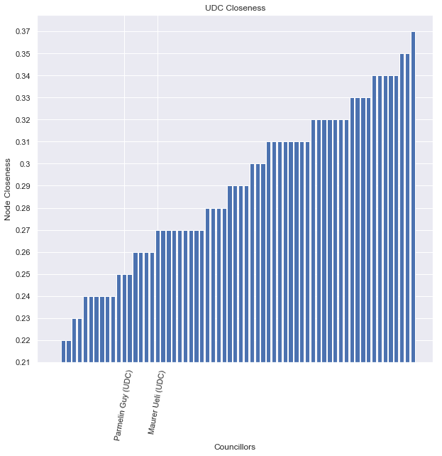
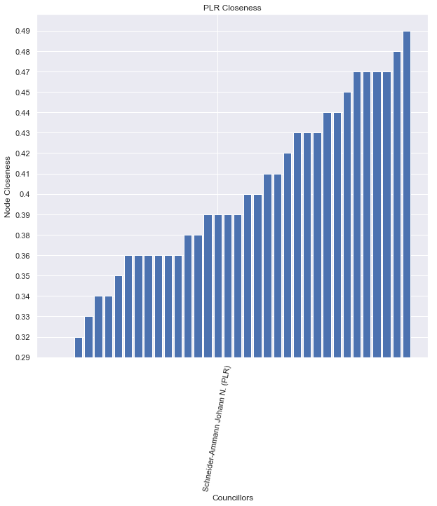

Political parties are often considered to be an essential part of democratic systems. Their existence is justified in two ways: First, they regroup politicians of similar opinions, which allows them to work towards their common goals. Second, they are needed in most political systems to form a government, by supporting presidential candidates like in the United States and France, or through coalitions like in most European countries. However, in the particular case of the Swiss democracy, the executive branch consists of a 7-headed council chosen to equally represent the entire voting population. This system doesn't inherently rely on political parties, raising the following question: Is their existence justified in the Swiss democratic model? We aim to answer this question by analysing the voting behavior of members of the national council, the larger of the two legislative chambers, over the course of 12 years.

# The Swiss Political System

Before getting started with the data analysis, we give a brief overview of the Swiss democratic system and introduce some terminology that we will use throughout the analysis. It is split up in a *legislative* (law-making) branch, an *executive* (governing) branch and a *judicative* (tribunal) branch. The legislative branch is further split up into two chambers: In the *national council* with 200 members, every canton has a number of seats proportional to its population. It is thus responsible for keeping the interests of the population. In the smaller *council of states*, every canton gets two seats, regardless of its size. It is therefore designed to keep the interests of the cantons. 

Whereas members of the executive and legislative branches of government are often members of political parties, their party affiliation should not have an impact on their work. Moreover, parties have a subsidiary role in the concil of states, since there the canton interest is more important than the interest of the individual politician. Hence, the political parties are only of real importance to the members of the national council, which is precisely the data we will look at in our analysis.

Politicians of the legislative branch are re-elected every 4 years. This period of 4 years where mostly the same politicians are working together making laws is called a legislative period. Within our analysis we will look at three such legislative periods, considering data from summer 2007 until summer 2019. Since many politicians change from period to another, we will split up our analysis into the individual legislative periods.

Finally there are a few politicians that come from minor, mostly regional parties in the national council. They can join forces with the large national parties by forming a parliamentary group. This is actually required for them if they want to join a comission, which is why only very few politicians never join a parliamentary group. In order to avoid having to look at very small parties, we will look at the parliamentary groups instead throughout our analysis.

# Recovering Political Parties

In order to first see whether the political parties make sense, we create a social network of politicians where every politician is connected to the politicians whose voting behavior is closest to theirs. Based on this network we try to divide the politicians into communities using the spectral clustering algorithm. We visualize this on a two-dimensional representation of the network, where nodes are closer to each other if they're closer on the network. 

Here are the results of the spectral clustering, followed by the true parliamentary group of the politician.

<iframe src="assets/html/spectral_clustering.html" width="100%" height="500" scrolling="no" seamless="seamless" frameborder="0"></iframe>

<iframe src="assets/html/party_assignment.html" width="100%" height="500" scrolling="no" seamless="seamless" frameborder="0"></iframe>

We see that the clustering consistently splits the conservative party (UDC) into two fractions. Moreover, the green party seems to get increasingly close to the socialdemocratic party with the two being indistinguishable towards the end. Other than some politicians in the middle of the political spectrum, the clustering seems to do a very good job in recovering the political parties.

<iframe src="assets/html/spectral_clustering.html" width="100%" height="500" scrolling="no" seamless="seamless" frameborder="0"></iframe>

We see that the clustering consistently splits the conservative party (UDC) into two fractions. Moreover, the green party seems to get increasingly close to the socialdemocratic party with the two being indistinguishable towards the end. Other than some politicians in the middle of the political spectrum, the clustering seems to do a very good job in recovering the political parties.

**Witere stuss**

# Picking an Executive Power 

In Switzerland the executive branch of government consists of a council of 7 people, which are chosen to roughly represent the political landscape of Switzerland. They are elected by the Federal Assembly (National Council as well as the State Council). We are interested in finding out if their pick can be justified by our data. There is no obvious reason why a Member of the Council is elected over another, although it seems from the media coverage that the party of a candidate plays a major role.
Yet we have seen that belonging to a party did not necessarily guaranteed a voting pattern nor an active support to other party members. Does the assumption of party membership importance hold under the light of our analysis? If party membership was a key element, the elected member would need to be representative of his party, which we simplify as being "central" in the cluster of the party. To test the sub-mentioned assumption, we look at the votes of members of the National Council in the legislature antecedent their election to the Federal Council to see whether they could be considered as "central" at the time of the elections.

The politicans for which we have data available are:

- Parmelin Guy (UDC) in function as Federal Counciller from 2016

- Schneider-Ammann Johann N. (PLR) Federal Counciller from 2010 to 2018

- Maurer Ueli (UDC) in function as Federal Counciller from 2010

Unfortunately, other federal councilors were not part of the National Council at the time for which we have data. While this is too few data points to derive some meaningful conclusion, it is still interesting to see what information can be drawn from those points. We chose here to only look at information from the first legislature as it is the only one where all there councilors are present. 

## Visualizing Centrality
<iframe src="assets/html/real_graph.html" width="100%" height="500" scrolling="no" seamless="seamless" frameborder="0"></iframe>
From the graph, it seems that none of the examples we have seen are very central in their party. Ueli Maurer is even quite far apart from the rest of UDC. Johann Schneider-Ammann seems also somewhat isolated. This would indicate that having a voting pattern representative of one's party isn't essential to be elected for the federal council. This can be futher proven by ranking each members "closeness" to the rest of it's party.  

None of the federal councillors are the obvious pick of their party since a lot of other members of both UDC and PLR would be a lot more representative that the ones that actually got elected. The few councillor we can observe would then suggest that party isn't as relevant to one's election as the media would suggest. *This is further proof that political party are not relevant in the Swiss Political System*. 

## A Better Alternative
Nonetheless, it seems intutive to pick 7 members of the executive power that each best represent a subgroup of the legislative power. This would result with law makers satisfied of the execution of their laws. Do do this we can split the members of the National Council in 7 groups based on their votes and pick for each group the politican that is in the middle. 

<iframe src="assets/html/best_graph.html" width="100%" height="500" scrolling="yes" seamless="seamless" frameborder="0"></iframe>
Since the Federal Councilor has just been re-elected, this method can be used to determined who would have been a good rational pick. The results is: 
- Flach Beat (PVL)
- Mazzone Lisa     (PES)
- Feller Olivier (PLR)
- Marchand-Balet Géraldine (PDC)
- Piller Carrard Valérie (PSS)
- Stamm Luzi (UDC)
- Girod Bastien (PES)

It seems that the Federal Assembly uses an another methods to make his choice, an none of those councillors on this list has been elected on the 11th of December 2019.  

