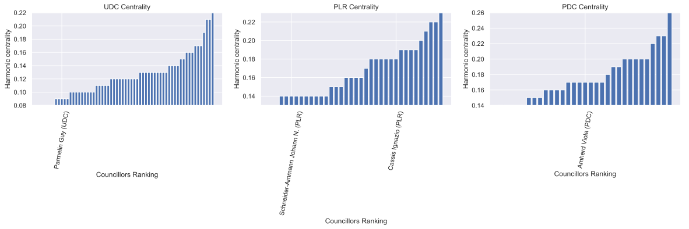

Political parties are often considered to be an essential part of democratic systems. Their existence is justified in two ways: First, they regroup politicians of similar opinions, which allows them to work towards their common goals. Second, they are needed in most political systems to form a government, by supporting presidential candidates like in the United States and France, or through coalitions like in most European countries. However, in the particular case of the Swiss democracy, the executive branch consists of a seven-headed council chosen to equally represent the entire voting population. This system doesn't inherently rely on political parties, raising the following question: Is their existence justified in the Swiss democratic model? We aim to answer this question by analysing the voting behavior of members of the national council, the larger of the two legislative chambers, over the course of 12 years.

# The Swiss Political System

Before getting started with the data analysis, we give a brief overview of the Swiss democratic system and introduce some terminology that we will use throughout the analysis. It is split up in a *legislative* (law-making) branch, an *executive* (governing) branch and a *judicative* (tribunal) branch. The legislative branch is further split up into two chambers: In the *National Council* with 200 members, every canton has a number of seats proportional to its population. It is thus responsible for keeping the interests of the population. In the smaller *Council of States*, every canton gets two seats, regardless of its size. It is therefore designed to keep the interests of the cantons. 

Whereas members of the executive and legislative branches of government are often members of political parties, their party affiliation should not have an impact on their work. Moreover, parties have a subsidiary role in the concil of states, since there the canton interest is more important than the interest of the individual politician. Hence, the political parties are only of real importance to the members of the national council, which is precisely the data we will look at in our analysis.

Politicians of the legislative branch are re-elected every 4 years. This period of 4 years where mostly the same politicians are working together making laws is called a legislative period. Within our analysis we will look at three such legislative periods, considering data from summer 2007 until summer 2019. Since many politicians change from period to another, we will split up our analysis into the individual legislative periods.

Finally there are a few politicians that come from minor, mostly regional parties in the national council. They can join forces with the large national parties by forming a parliamentary group. This is actually required for them if they want to join a comission, which is why only very few politicians never join a parliamentary group. In order to avoid having to look at very small parties, we will look at the parliamentary groups instead throughout our analysis.

# Recovering Political Parties

In order to first see whether the political parties make sense, we create a social network of politicians where every politician is connected to the politicians whose voting behavior is closest to theirs. Based on this network we try to divide the politicians into communities using the spectral clustering algorithm. We visualize this on a two-dimensional representation of the network, where nodes are closer to each other if they are closer on the network. 

Here are the results of the spectral clustering, followed by the true parliamentary group of the politician.

<iframe src="assets/html/spectral_clustering.html" width="100%" height="500" scrolling="no" seamless="seamless" frameborder="0"></iframe>
<iframe src="assets/html/party_assignment.html" width="100%" height="500" scrolling="no" seamless="seamless" frameborder="0"></iframe>

We see that the clustering consistently splits the conservative party (UDC) into two fractions. Moreover, the green party seems to get increasingly close to the socialdemocratic party with the two being indistinguishable towards the end. Other than some politicians in the middle of the political spectrum, the clustering seems to do a very good job in recovering the political parties.

# Picking an Executive Power 

In Switzerland the executive branch of government consists of a council of seven people, which are chosen to equally represent the entire voting population and is called the Federal Council. They are elected by the federal assembly (National Council as well as the Council of States). We are interested in finding out if their pick can be justified by our data. 

There is no obvious reason why a member of the council is elected over another, although it seems from the media coverage that the party of a candidate plays a major role.

 Does the assumption of relevance of party membership holds under the light of our analysis? 
 
 Assessing if the political party really weighted in the federal assembly decision is a complex and ambiguous task and could be tackled in many different ways. We assumed that if the party membership was a key element, the elected member would be representative of his party, which we simplify as being "central" in the cluster of the party. To test the sub-mentioned assumption, we look at the votes of members of the National Council in the legislature preceding their election to the Federal Council to see whether they could be considered as "central" at the time of the elections.

The politicans for which we have data available are:

- Parmelin Guy (UDC) in function as federal councillor from 2016

- Schneider-Ammann Johann N. (PLR) federal councillor from 2010 to 2018

- Amherd Viola (PDC) in function as federal councillor from 2010

- Cassis Ignazio (PLR) in function  as federal councillor from 2017

Our analysis will be limited by the fact that only 4 federal councillors voting record are in the database. Therefore the conclusions drawn from our analysis should be taken with a grain of salt. We chose here to only look at information from the first legislature as it is the only one where all councillors are present.

## Visualizing Centrality
<iframe src="assets/html/real_graph.html" width="100%" height="500" scrolling="no" seamless="seamless" frameborder="0"></iframe>
From the graph, it seems that none of the examples we have seen are very central in their party. Guy Parmelin is even at the edge of the group. This would indicate that having a voting pattern representative of one's party is not essential to be elected for the Federal Council. This can be further proven by ranking each members "closeness" to the rest of its party.  

None of the elected councillors seem to have a voting pattern that is very representative of their political party. If a party would want one of their members to represent them in the Federal Founcil, they would probably vote for the most representative politician in their ranks. Our findings suggest that this is not the case. This is therefore in opposition with the way the media depicts the election. The interpretability of those results is of course very limited by the scarcity of the data. 

## A Better Alternative
The generally accepted idea that a politician is elected to the Federal Council mostly based on his/her political party is challenged by our previous results. Yet, this is a key argument in all debates surrounding the elections. This is even more true now, as the recent election for the Federal Council has raised a new controversy. The new council is criticized for not being representative enough of the current swiss political landscape. The major issue is the continued absence of councillors from the Green Party (PES), which has significantly grown in size in the last decade.

We make the claim that we can make a pick that is not based on political party, but simply on the voting pattern of the national councillors. Of course the executive power is not only chosen from the national council, so our solution is not optimal.

To make our pick we make the following assumptions:

- Voting patterns are a good indication of the political orientation of a councillor
- The optimal pick for the Federal Council is seven members whose political orientation is best representing seven equal sized sub-groups of the National Council
- The best single point representation of a group is at its center

We therefore split the National Council in seven subgroups and pick the most central politican in each of them. This results in a set of federal councillors for the upcoming legislative that might be more representative that the one that got elected. 

<iframe src="assets/html/next_legislative_pick.html" width="100%" height="500" scrolling="no" seamless="seamless" frameborder="0"></iframe>

There is no overlap between our pick and the current federal councillors. None of "our" councillors were even a candidate at a Federal Council election. This indicates that our way of selecting an executive power is quite different from what is currently implemented. We also see that no member of the Green Party is part of our pick, even though a member of the Green Liberal Party (PVL) who historically never had a federal councillor make it into the list.

This choice is limited by the fact that it is only representative of the National Council and not the Council of States. However, since the National Council is the one responsible for keeping the interests of the population and is directly elected by the people, we can assume that it is representative of the population. 

A remaining issue is that this pick is only taking into account national councillors and not state councillors which are also often candidates. 

If there is no way of knowing that this pick would make a good executive power, it would at least be a bold new choice. 

## Conclusion 

The need of political parties in Switzerland can be challenged by looking at the votes of some of the members of the legislative power over 12 years. 

The two common for their existance is Of the two common justifications for their existence, only one seems to hold up. 

Swiss political parties do regroup politicians of similar opinions. Regrouping people that vote in a similar way results in regrouping people by their party membership. 

However, they are not needed to form a government. The politicians that get elected are not a good representation of the party they belong to. Furthermore, they are criticized for being unrepresentative of the general population. By assuming that the National Council is more representative of the population, a pick that does not take into account the political party can be performed, contradicting the second common justification for political parties existence. 

